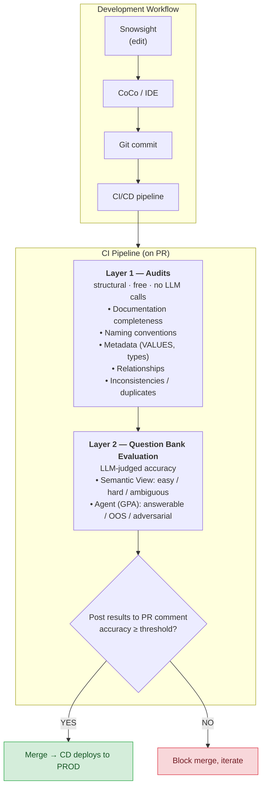

# Snowflake AgentOps Framework

A governance framework for **Semantic Views** and **Cortex Agents** in Snowflake. Clone this repo, point it at your existing agents, and get CI/CD quality gates, automated monitoring, and an App Runtime dashboard — without rebuilding your environment.

---

## What this does

1. **Discovers** your existing semantic views and agents
2. **Evaluates** them with question banks + LLM-as-a-judge
3. **Monitors** accuracy, cost, latency, and interaction quality over time
4. **Gates** promotions via CI/CD pipelines (any CI system)
5. **Alerts** on regressions, feedback spikes, and cost anomalies

---

## Architecture



---

## Getting started

### Prerequisites

- Python 3.11+
- A Snowflake account with Cortex AI features enabled
- Existing semantic views and/or agents you want to govern
- A named connection in `~/.snowflake/connections.toml`
- [Cortex Code](https://docs.snowflake.com/en/user-guide/cortex-code) (recommended)

### Bootstrap with Cortex Code (recommended)

The framework ships a bundled Cortex Code skill at `.cortex/skills/bootstrap-from-existing/`. Cortex Code does not auto-discover skills bundled in a repo, so you register it once per clone, then invoke it.

1. Open this repo in Cortex Code.

2. Register the skill (one time per clone). Run this from the **repo root**:
   ```
   /skill add ./.cortex/skills/bootstrap-from-existing
   ```
   > `/skill add` resolves the relative path at add-time and stores an absolute path in `~/.snowflake/cortex/skills.json`. Run it from the repo root or the registration will point at the wrong location.

3. Invoke the skill:
   ```
   /bootstrap-from-existing
   ```

The skill will:
1. Discover your existing semantic views and agents (`SHOW SEMANTIC VIEWS/AGENTS IN ACCOUNT`)
2. Let you select which to bring under governance
3. Ask for a database + schema to store framework tables
4. Generate `config/environments.yaml`
5. Execute the setup SQL to create framework objects
6. Seed starter question banks from your semantic view structure

### Manual setup

1. Install dependencies:
```bash
pip install -r requirements.txt
```

2. Copy config templates:
```bash
cp config/environments.yaml.template config/environments.yaml
cp config/thresholds.yaml.template config/thresholds.yaml
cp config/monitoring.yaml.template config/monitoring.yaml
```

3. Edit `config/environments.yaml` — fill in your semantic view FQNs, agent FQNs, and framework DB/schema.

4. Create the framework objects. `setup/00_framework_tables.sql` contains three placeholders — `{{FRAMEWORK_DB}}`, `{{FRAMEWORK_SCHEMA}}`, and `{{WAREHOUSE}}`. Substitute your values and run the script against your account (via a Snowsight worksheet, `snow sql`, or the Python connector). The bootstrap skill above performs this substitution and execution for you.

5. Create question banks in `question_banks/` and run your first evaluation.

---

## Directory structure

```
Snowflake_AgentOps_Framework/
├── .cortex/skills/      # Cortex Code bootstrap skill
├── agents/              # Agent specs under governance
├── semantic_views/      # Semantic view definitions under governance
├── question_banks/      # Evaluation question banks (agent + semantic_view)
├── evaluation/          # Evaluation + monitoring Python (audits, judge, health, cost)
├── setup/               # Framework SQL objects + deploy helper
├── config/              # Configuration (environments, thresholds, monitoring, defaults)
├── app/                 # App Runtime monitoring dashboard (Next.js)
└── docs/                # Reference, how-to & explanation docs
```

For the full file-by-file layout, see [AGENT.md](AGENT.md).

---

## Run evaluations locally

You can run audits, evaluations, question-bank generation, and health checks from the command line against any configured environment. See [How-to: Run evaluations locally](docs/how-to/run-evaluations-locally.md) for the full command reference.

---

## Sync edits from Snowsight into git

When you edit a semantic view or agent in the Snowsight UI, pull that change back into the repo so it can be reviewed and deployed:

```bash
python evaluation/sync_from_snowflake.py --environment dev
```

This is the inverse of `setup/deploy.py` — it captures the live definition into a reviewable `.yaml`, closing the `Snowsight → Git` step shown in the architecture diagram. See [How-to: Sync edits from Snowsight into git](docs/how-to/sync-edits-from-snowsight.md).

---

## Monitoring & observability

The framework creates tables, views, alerts, and tasks in your chosen schema (see `setup/00_framework_tables.sql`). Three daily tasks aggregate usage, feedback, and interaction-quality data, and seven Snowflake Alerts fire on regressions — feedback spikes, accuracy drops, latency degradation, cost anomalies, error spikes, health failures, and interaction-quality issues. See [Pillar 3: Runtime monitoring](docs/explanation/pillar-3-runtime-monitoring.md) for the full task schedule, alert thresholds, and severity logic.

### Monitoring dashboard (App Runtime)

Deploy the Next.js dashboard to Snowflake:

```bash
cd app && snow app setup --app-name="agentops-monitoring" && snow app deploy
```

The dashboard shows: KPIs, accuracy trends, interaction quality flags, token costs, user feedback, and active alerts — filterable by agent, environment, and time window.

---

## CI/CD pipeline

See [Set up CI/CD](docs/how-to/set-up-ci-cd.md) for full documentation on pipeline stages and how to wire them into GitHub Actions, GitLab CI, Azure DevOps, or any other CI system.

**Pipeline stages:**
1. **Audit** — structural checks (free)
2. **Evaluate** — question bank accuracy (LLM-judged)
3. **Deploy** — promote to production

---

## Configuring thresholds

Quality gates are configured per environment in `config/thresholds.yaml` — permissive on DEV (lets developers iterate) and strict on PROD (protects production quality). See [Pillar 2: Output evaluation](docs/explanation/pillar-2-output-evaluation.md#quality-gates-in-ci) for the threshold model and a worked example.

---

## Documentation

| Document | Type | What it covers |
|----------|------|----------------|
| [Set up CI/CD](docs/how-to/set-up-ci-cd.md) | How-to | Pipeline stages, env vars, wiring into any CI |
| [Run evaluations locally](docs/how-to/run-evaluations-locally.md) | How-to | CLI commands for audits, evals, and health checks |
| [Sync edits from Snowsight into git](docs/how-to/sync-edits-from-snowsight.md) | How-to | Pull UI edits back into the repo as reviewable `.yaml` |
| [docs/README.md](docs/README.md) | Index | Documentation map |
| [Cost model](docs/reference/cost-model.md) | Reference | Evaluation cost in AI Credits |
| [Pillar 1: Input governance](docs/explanation/pillar-1-input-governance.md) | Explanation | Semantic view audit design |
| [Pillar 2: Output evaluation](docs/explanation/pillar-2-output-evaluation.md) | Explanation | Question banks, LLM judge, GPA eval, CI gates |
| [Pillar 3: Runtime monitoring](docs/explanation/pillar-3-runtime-monitoring.md) | Explanation | Interaction-quality engine, alerts, trend views |
