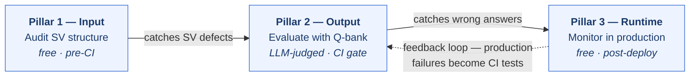

# Documentation

> Status: Stable | Last reviewed: 2026-06-08 | Audience: Engineers, solution architects, customers

**Purpose.** This is the documentation map for the Snowflake AgentOps Framework. It is organized using the [Diataxis](https://diataxis.fr/) framework, which separates documentation by what the reader needs.

## How this documentation is organized

| Mode | Directory | Answers the question | When to read |
| --- | --- | --- | --- |
| How-to | `how-to/` | "How do I perform this task?" | You need step-by-step commands for a specific job |
| Reference | `reference/` | "What are the exact details?" | You need precise, lookup-style information |
| Explanation | `explanation/` | "Why does it work this way?" | You want to understand the design and tradeoffs |

The root [README](../README.md) is the project entry point and getting-started guide. The [ci/README](../ci/README.md) covers CI/CD pipeline wiring. This `docs/` tree holds deeper reference and explanation material.

## Explanation — The Three Pillars

The framework is built on three complementary pillars. Each doc explains the design philosophy, what the pillar does today, and where it is headed:

1. [Pillar 1: Input Governance](explanation/pillar-1-input-governance.md) — Audit the semantic view (the agent's input) for structural defects before the agent ever runs. Free, deterministic, domain-agnostic today; AI-generated domain-aware rules on the roadmap.

2. [Pillar 2: Output Evaluation](explanation/pillar-2-output-evaluation.md) — Test agent outputs using question banks, LLM-as-a-judge, and Snowflake's native GPA evaluation. CI quality gates prevent regressions from reaching production.

3. [Pillar 3: Runtime Monitoring](explanation/pillar-3-runtime-monitoring.md) — Monitor agents in production with rules-based interaction quality detection, alerts, and trend analytics — all from native observability events at near-zero cost.

**How the pillars work together:**

## How-to

Task-oriented, step-by-step guides.

- [Run evaluations locally](how-to/run-evaluations-locally.md) — CLI commands for audits, evaluations, question-bank generation, and health checks against a configured environment.

## Reference

Information-oriented, lookup-style material.

- [Cost model](reference/cost-model.md) — how evaluation cost is computed in Snowflake AI Credits, the formula, worked examples, and levers to reduce spend.

## Documentation conventions

Every document in this tree leads with a single H1 title, a `Status | Last reviewed | Audience` metadata blockquote, and a one-line **Purpose** statement, and uses sentence-case headings, relative links, language-tagged code fences, and tables for reference data. When adding a document, place it in the directory matching its Diataxis mode and link it from this index.
