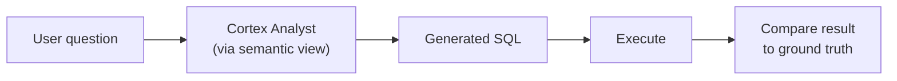
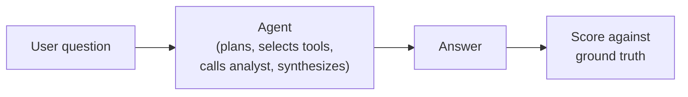
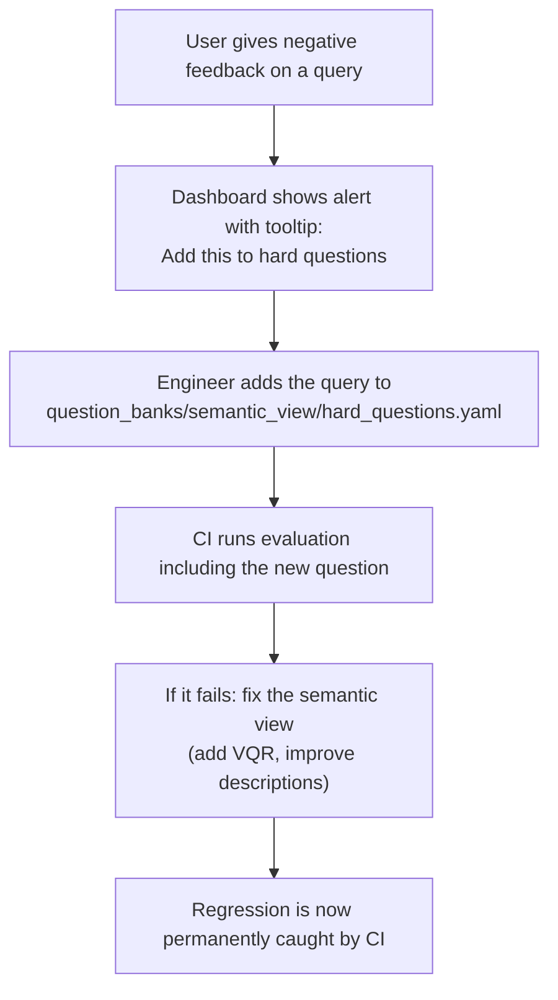
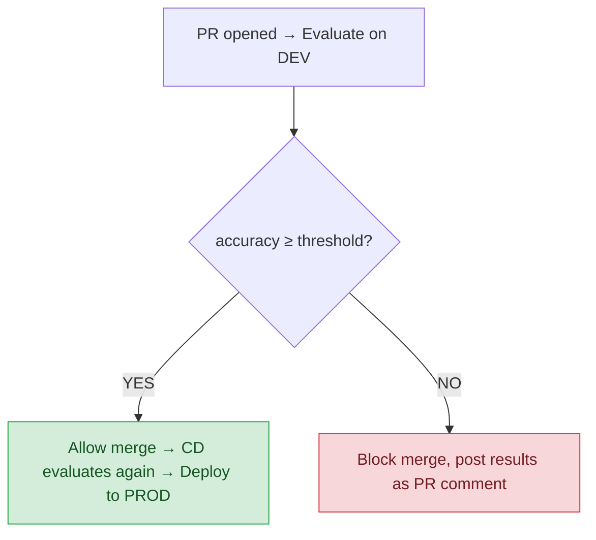

# Pillar 2: Output Evaluation

> Status: Stable | Last reviewed: 2026-06-21 | Audience: Engineers, solution architects, customers

**Purpose.** Explain how the framework evaluates the quality of agent and semantic view outputs using question banks, LLM-as-a-judge, and Snowflake's native GPA evaluation — and how these gates prevent regressions from reaching production.

## The idea behind output evaluation

Pillar 1 catches defects in the agent's inputs (the semantic view). Pillar 2 catches defects in the agent's **outputs** — what it actually says and does when users ask questions.

The premise: a semantic view can pass all structural checks and still produce wrong answers for specific query patterns. The only way to know is to ask it questions and check the answers. This is expensive (requires LLM calls), so the framework makes it efficient through question banks, caching, and graduated thresholds.

## Two evaluation paths

### Semantic view evaluation (`evaluate_semantic_view.py`)

Tests the text-to-SQL pipeline directly:



The evaluator:
1. Sends each question from the bank to Cortex Analyst
2. Executes the generated SQL
3. Compares results against expected SQL output
4. Uses an LLM judge to score ambiguous cases

**Three difficulty categories:**

| Category | What it tests | Judging method | Typical threshold (PROD) |
|----------|---------------|----------------|--------------------------|
| Easy | Single-table queries, basic aggregations | SQL result comparison (exact match) | 95% |
| Hard | Multi-table joins, complex filters, edge cases | SQL result comparison + LLM judge | 75% |
| Ambiguous | Questions with multiple valid interpretations | LLM-as-a-Judge only (semantic similarity) | 60% |

### Agent evaluation (`audit_agent.py`)

Tests the full agent orchestration using Snowflake's native `EXECUTE_AI_EVALUATION` with the GPA (Grounded Performance Assessment) framework:



**Built-in + custom metrics:**

| Metric | Type | What it measures |
|--------|------|-----------------|
| `answer_correctness` | Built-in | Semantic match against ground truth |
| `logical_consistency` | Built-in | Internal reasoning coherence |
| `safety` | Custom LLM-judged | Scope/boundary compliance |
| `groundedness` | Custom LLM-judged | Claims supported by tool outputs |
| `execution_efficiency` | Custom LLM-judged | Optimal tool selection |
| `answer_relevance` | Custom LLM-judged | Response addresses the question |
| `conciseness` | Custom LLM-judged | No unnecessary verbosity |
| `pii_leakage` | Custom LLM-judged | No PII exposed in answers |

## Question banks

Question banks are YAML files in `question_banks/` that define what gets tested:

```yaml
# question_banks/semantic_view/hard_questions.yaml
questions:
  - question: "What was the revenue by region for Q4 last year?"
    expected_sql: |
      SELECT region, SUM(revenue) as total_revenue
      FROM orders JOIN stores ON orders.store_id = stores.store_id
      WHERE order_date >= '2025-10-01' AND order_date < '2026-01-01'
      GROUP BY region
    difficulty: hard
    tags: [multi-table, date-filter, aggregation]
```

### Sources for question bank content

1. **Auto-generated** — `python evaluation/generate_question_bank.py` reads your semantic view and generates starter questions using an LLM
2. **Mined from traffic** — the generator can also mine real user queries from `AGENT_REQUEST_SUMMARY` (observability traces)
3. **Feedback-driven** — add queries from negative user feedback (the dashboard's alert tooltips recommend this)
4. **Adversarial** — curated attack patterns from `evaluation/adversarial_library.yaml` (prompt injection, data exfiltration, scope violations)

### The feedback loop

The most powerful pattern: **user feedback drives question bank growth**.



This creates a ratchet effect — every production failure becomes a regression test.

## LLM-as-a-Judge (`llm_judge.py`)

For ambiguous questions where SQL comparison isn't sufficient, the framework uses an LLM to judge whether the generated answer is semantically equivalent to the expected answer:

- **Input**: the question, the expected answer/SQL, the generated answer/SQL, and optionally the query results
- **Output**: a score (0-1) and reasoning text explaining the judgment
- **Model**: configurable in `config/defaults.yaml` (`llm.judge_model`), defaults to `claude-opus-4-7`

The judge is deliberately separate from the agent being evaluated — this prevents the agent from "gaming" its own evaluation.

## Quality gates in CI

Evaluation results gate merge/deploy:



Thresholds are configured in `config/thresholds.yaml`:

```yaml
semantic_view:
  dev:
    easy_min_accuracy: 90
    hard_min_accuracy: 65
    ambiguous_min_accuracy: 50
  prod:
    easy_min_accuracy: 95
    hard_min_accuracy: 75
    ambiguous_min_accuracy: 60
```

DEV thresholds are intentionally permissive (lets developers iterate), while PROD thresholds are strict (protects production quality).

## Cost considerations

Each evaluation question costs approximately 0.29 AI Credits (with 8 GPA metrics, using `claude-opus-4-7`). See [docs/reference/cost-model.md](../reference/cost-model.md) for the full breakdown and budget planning.

Key cost levers:
- **Smaller question banks** — test with 10 questions during development, 50 for CI gates
- **Fewer metrics** — each metric is one judge call per question; drop metrics you don't need
- **Cheaper judge model** — switch to a Haiku-class model for faster, cheaper judging
- **Pre-flight smoke check** — run 3 questions first; abort if they all fail

## Summary

- **Semantic View eval**: tests text-to-SQL accuracy using question banks + LLM judge
- **Agent eval**: tests full orchestration using Snowflake's native GPA framework
- **Question banks**: curated sets that grow from auto-generation, traffic mining, and user feedback
- **Quality gates**: configurable accuracy thresholds that block merges to production
- **Cost**: ~0.29 credits/question; manageable with tiered banks and metric pruning
