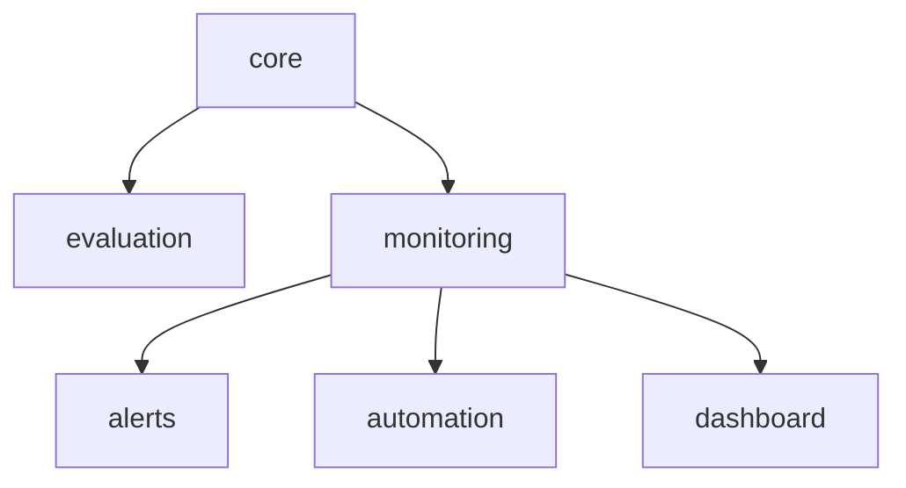

# How to choose which framework modules to install

The AgentOps framework is split into six selectable capability **modules** so
you can deploy only what you need. A customer who just wants dashboards over
their usage data does not have to take the CI/CD evaluation layer; a customer who
only wants monitoring tables can skip alerts, tasks, and the dashboard.

Modules are declared in [`modules.yaml`](../../modules.yaml) and installed by
[`setup/install.py`](../../setup/install.py).

## The modules

| Module | Installs | Depends on |
|---|---|---|
| `core` | framework schema + observability views over `ACCOUNT_USAGE` / `ai_observability_events` | — (always installed) |
| `evaluation` | eval result tables + accuracy trend view; pairs with `evaluation/*.py`, `question_banks/`, and the CI workflows (the "devops" layer) | `core` |
| `monitoring` | monitoring tables (usage/cost, feedback, health, alerts history, interaction quality) + all trend/quality/dashboard views | `core` |
| `alerts` | seven Snowflake Alerts that fire on regressions | `monitoring` |
| `automation` | three scheduled tasks that populate the monitoring tables daily | `monitoring` |
| `dashboard` | the Next.js App Runtime dashboard in `app/` (per-page toggles) | `monitoring` |

`core` is always installed. Dependencies are pulled in automatically — asking for
`dashboard` installs `monitoring` and `core` too. The accuracy-regression alert
is applied only when both `alerts` and `evaluation` are installed (it reads the
evaluation module's `V_EVAL_ACCURACY_TREND`).



## Common recipes

| I want... | Modules to pass |
|---|---|
| The full framework (classic behavior) | `all` |
| Dashboard + data, but no CI/CD | `monitoring,dashboard` |
| Just the monitoring tables and views | `monitoring` |
| Monitoring + automated daily rollups | `monitoring,automation` |
| Monitoring + alerting, no dashboard | `monitoring,alerts,automation` |
| Only the evaluation / CI-CD layer | `evaluation` |

## Commands

```bash
# See the modules and what's currently installed
python setup/install.py --list

# Preview (no changes) then install a subset
python setup/install.py --modules monitoring,dashboard --dry-run
python setup/install.py --modules monitoring,dashboard

# Install everything
python setup/install.py --modules all

# Add a module later (idempotent; safe to re-run)
python setup/install.py --modules alerts

# Remove a module (reverse-dependency safe)
python setup/install.py --uninstall --modules alerts

# Remove monitoring and everything that depends on it
python setup/install.py --uninstall --modules monitoring --cascade
```

The installer:

- resolves dependencies and orders SQL execution,
- substitutes `{{FRAMEWORK_DB}}` / `{{FRAMEWORK_SCHEMA}}` / `{{WAREHOUSE}}` from
  `config/environments.yaml` (`framework.*`),
- executes each statement through the Snowflake connector (so multi-statement
  task bodies stay intact — `snow sql -q` would split them),
- records the installed set in `.agentops-installed.yaml`.

The `/agentops-configure` skill wraps these commands with interactive prompts.

## Prerequisites

- `config/environments.yaml` with `framework.database`, `framework.schema`, and
  (for `alerts` / `automation`) `framework.warehouse`. The `bootstrap-from-existing`
  skill generates this.
- Python deps from `requirements.txt` (`snowflake-connector-python`, `pyyaml`).

## The dashboard is optional down to the page

The `dashboard` module ships six pages, each backed by a module:

| Page | Requires module |
|---|---|
| Overview | `monitoring` |
| Accuracy | `evaluation` |
| Quality | `monitoring` |
| Cost | `monitoring` |
| Feedback | `monitoring` |
| Alerts | `alerts` |
| Settings | `monitoring` (schedule edits also need `automation`) |

Expose only the pages you want by editing `ENABLED_PAGES` in
[`app/lib/agentops.config.ts`](../../app/lib/agentops.config.ts):

```ts
export const ENABLED_PAGES: PageKey[] = ["overview", "cost", "feedback"]
```

Disabled pages are hidden from the navigation and, if opened directly, render a
"module not installed" notice instead of erroring. Redeploy the app
(`cd app && snow app deploy`) after changing `ENABLED_PAGES`.

## Notes

- `automation` tasks are created SUSPENDED. Resume them to start collection:
  `ALTER TASK <db>.<schema>.TASK_DAILY_USAGE_AGGREGATION RESUME;` (repeat for the
  feedback and interaction-quality tasks), or resume them in Snowsight.
- `TASK_WEEKLY_EVALUATION` is only installed when `evaluation` is also selected,
  because it is the writer for that module's `SCHEDULED_EVAL_RUNS` table. It runs
  a native Cortex Analyst evaluation against the semantic view's **verified
  queries** (not the `question_banks/` used by CI), so its accuracy is a separate
  series on the Accuracy page rather than a continuation of the CI trend.
  It needs two opt-ins, not one:

  ```sql
  UPDATE <db>.<schema>.EVAL_SCHEDULE_CONFIG
     SET semantic_view = '<DB>.<SCHEMA>.<VIEW>', is_enabled = TRUE
   WHERE config_id = 'default';
  ALTER TASK <db>.<schema>.TASK_WEEKLY_EVALUATION RESUME;
  ```

  Run it once without scheduling it with `EXECUTE TASK <db>.<schema>.TASK_WEEKLY_EVALUATION;`.

  Two requirements that are easy to miss:
  - The task owner needs, under a **single primary role** (task execution ignores
    secondary roles): `SNOWFLAKE.CORTEX_USER`, `USE AI FUNCTIONS`,
    `EXECUTE TASK ON ACCOUNT`, `CREATE DATASET` on the framework schema, and
    `SELECT` + `MONITOR` on the semantic view.
  - The semantic view must declare `data_type` on every fact. Without it the run
    fails with `Required field 'data_type' in Fact is missing` (392700). Plain
    Cortex Analyst calls tolerate the omission, so a view can work fine in an
    agent yet still fail evaluation.
- Re-running the installer is safe — all DDL uses `CREATE ... IF NOT EXISTS` or
  `CREATE OR REPLACE`.
- To turn a capability off, uninstall its module — never hand-edit the
  `modules/**/sql/*.sql` files to disable pieces.
